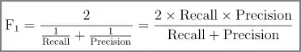

# Accuracy, Precision, Recall, F1-score 복습

서울과학기술대학교 데이터사이언스학과 홍정식 교수님의 데이터마이닝 수업 자료와 ‘[핸즈온 머신러닝](http://www.kyobobook.co.kr/product/detailViewKor.laf?ejkGb=KOR\&mallGb=KOR\&barcode=9791162242964\&orderClick=LAG\&Kc=)’을 참고하여 작성하였음.

## 요약 

$$
\text{Accuracy}=\frac{\text{올바르게 분류}}{\text{전체}}
$$

$$
\text{Recall} = \frac{\text{예측1} \cap \text{실제1}}{실제1}
$$

$$
\text{Precision} = \frac{\text{예측1} \cap \text{실제1}}{예측1}
$$

$$
\text{F1-Score} = \text{Recall과 Precision의 조화평균}
$$

## 기본 예시

아래와 같은 BFP(body fat percentage)라는 데이터가 있다고 해보자. 이 데이터로 남성/여성 분류를 해보자.

<figure><figcaption></figcaption></figure>

아주 아주 간단한 모델이 있다. 이 모델은 BFP가 20보다 높으면 여자, 낮으면 남자라고 분류했다고 하자. 나르샤, 류담, 정형돈이 잘못 분류되었고 나머지 사람들은 잘 분류되었다!

그런데 20이라는 값으로 잘 나누었다고 할 수 있을까? 이 모델의 성능은 몇이라고 해야할까?

## **Confusion matrix (혼동 행렬)** 

Confusion matrix는 기계학습 분야에서 지도 학습으로 훈련된 분류 알고리즘의 성능을 시각화 할 수 있는 표이다. (위키피디아)

분류 결과를 가지고 Confusion matrix를 그려보면 아래와 같다.

<figure><figcaption></figcaption></figure>

Actual은 정답라벨을 의미하고, Predicted는 예측된 라벨을 의미한다. 위에서 얘기한 것처럼, 나르샤는 실제론 여자(F)인데 남자(M)로 분류되어 F행 M열에 위치해있고, 류담과 정형돈은 실제로는 남자(M)인데 여성(F)으로 분류되어 M행의 F열에 위치해있다. 나머지 칸은 올바르게 분류되었다.

이 표를 좀 더 일반화해볼까? Confusion matrix를 기반으로 다음과 같은 지표들이 생성될 수 있다.

## 1. Accuracy 

<figure><figcaption>
1 — Misclassification error, 정확도
</figcaption></figure>

가장 직관적인 비율이다. 전체 데이터 샘플 중에서 올바르게 분류된 샘플의 수를 비율로 나타낸 것이다.

### 1.1 Accuracy의 한계 

그런데 Accuracy는 데이터에 따라 잘못된 통계를 나타낼 수도 있다. 예를 들어 스팸메일이면 1, 정상 메일이 아니면 0이라고 예측하는 모델을 만들었다고 해보자.

근데, 일반적으로 정상적인 메일이 대다수이고 스팸메일은 많은 비중을 차지하지 않는다. 예를 들어 정상 메일이 95개, 스팸메일이 5개라고 해보자. 그리고 이 모델이 스팸 메일을 1개밖에 걸러내지 못했고, 정상 메일 중에서 5개를 스팸 메일로 잘못 예측했다고 해보자. 그럼 Confusion matrix는 어떻게 될까?

<figure><figcaption></figcaption></figure>

여기서 Accuracy를 구해보면, 91/100=0.91, 무려 91%의 정확도를 가진 모델이 된다. 언뜻 보면 높아보이지만, 좋은 모델이라고 절대로 할 수 없다. 왜냐하면 **데이터 Imbalance가 심하기 때문이다.** 모두 정상 메일이라고 예측해도 95%가 나오기 때문에 **Imbalance가 심한 데이터에서는 Accuracy를 신뢰할 수 없다.**

이처럼 클래스 분포 및 원하는 task에 따라 Recall, Precision, F1-Score등의 다양한 관점에서 성능을 측정해야한다.\

## 2. Recall 

‘재현율’이라고도 부르는 Recall의 수식은 다음과 같다.\

<figure><figcaption>
실제 1에 대한 (예측 1 ∩ 실제 1)의 비율.
</figcaption></figure>

\

<figure><figcaption></figcaption></figure>

실제 1에 대한 (예측 1 ∩ 실제 1)의 비율이다. 위의 예시를 다시 보자. 실제 스팸메일이 5개 였는데(주황 박스) 이 중에서 1개만(파란 박스) 올바르게 예측했으므로 Recall은 1/5=0.2가 된다. Accuracy는 매우 높았는데 Recall은 매우 낮다. Accuracy만 보고 좋은 모델이라고 했으면 큰일 날 뻔했다.

### **2.1 Recall을 봐야 하는 이유** 

예를 들어보자. 감시카메라로 좀도둑을 잡아내는 분류기를 학습시키고자 한다. 이 경우에는 좀도둑이라고 예측한 케이스가 많아도 상관없다. 못 잡아내는 단 1번이 너무 크리티컬하기 때문이다. 이 잡듯 여기저기 다 뒤져서라도 잡으면 그게 못 잡는 것보다 나은 경우이다. 그렇다면,

Recall( = (예측1 ∩ 실제1) / 실제1)이 중요할까? Precision( = (실제1 ∩ 예측1) / 예측1)이 중요할까?

Recall이 올라가려면 예측1이 많으면 많을수록 높아지긴 한다. 그러니까 Recall을 사용하는 경우는 예측1이 아무리 많아도 타격 없는, 1을 잡아내는게 너무나도 중요한 경우이다. 질병을 예측하는 일도 Recall 성능을 확인해야 할 것이다. 왜냐하면 일단 질병이라고 예측했는데, 아니더라도 큰 타격이 없기 때문이다. 그러나 이 질병을 맞추지 못한 경우에는 어마어마한 페널티가 따를 것이다.

<figure><figcaption>
Recall : 빈대 잡다가 초가삼간 다 태워도 괜춘.
</figcaption></figure>

## 3. Precision 

다시 예시로 돌아와보자. 만약 이 모델이 모든 메일을 스팸메일이라고 예측하는 아주 못된(?) 모델이라고 해보자. 그 때의 Confusion matrix는 다음과 같다.

<figure><figcaption></figcaption></figure>

이 경우에는, Accuracy = 5 / 100 = 0.05이고, Recall = 5 / 5 = 1이 나오게 된다. 아니 무려 Recall이 1이다. 왜 이런 일이 일어났는가?

바로 Recall은 실제 1 중에서 예측 1이 얼만큼 채워졌는지 만을 보기 때문에 싹 다 1로 예측해버리면 속수무책이다. 이런 상황에서는 Precision(정밀도)가 도움이 될 수 있다. Precision은 다음과 같다.

<figure><figcaption>
예측 1에 대한 (실제 1∩예측 1)의 비율.
</figcaption></figure>

예측을 1로 내놓은 것 중에서 실제 1이 얼마나 차지하는 지를 나타낸 것이다. 위의 예시에서 Precision을 계산해보면, Precision=5 / 100 = 0.05가 된다. 갑자기 왜 이렇게 낮아졌냐? 하면, 1로 예측한 것은 엄청 많은데, 그 중에 실제 1이 별로 없기 때문이다.

<figure><figcaption></figcaption></figure>

### 3.1 Precision이 중요한 경우는? 

(실제 1∩ 예측 1 ) / 예측 1 가 의미하는 것은 뭘까? 1로 예측한 것 중에서 실제 1이 많이 들어있으면 된다. 그럼 예측1을 무작정 늘릴 수 없다. 차라리 확실하게 1인 것만 1로 예측하면 Precision은 높다.

Precision이 높다? 이것은 모델이 **모든 1을 잘 잡아낸다고 할 순 없어도, 1이라고 예측하면 거진 다 1이라는 것이다.**

내가 써 놓고도 너무 헷갈린다.

대표적으론 스팸메일 분류가 Precision 지표를 사용하면 좋다. 정상적인 메일까지 이 잡듯 뒤져서 분류할 필요는 없다. 대신에 스팸이라고 분류했으면, 진짜 스팸이기만 하면 만족스럽다. 실제로도 사용자는 스팸함에 잘 들어가지 않는다. 그래서 정상 메일이 하나라도 스팸함에 들어가면 이 서비스를 중단하고 싶어질 것이다.

<figure><figcaption></figcaption></figure>

## 4. F1-Score 

지금까지를 요약해보면 이렇다.

실제 1 중에서 예측 1이 얼마나 차지하는가? → Recall.

예측 1 중에서 실제 1이 얼마나 차지하는가? → Precision.

둘 다 성능을 계산하는 지표로서 타당해 보인다.

Recall과 Precision을 F1-Score라는 하나의 숫자로 만들면 편리할 때가 많다. 특히 두 분류기를 비교할 때 좋다. F1-Score는 아래와 같이 Recall과 Precision의 조화 평균이다.

<figure><figcaption>
Recall과 Precision의 조화평균.
</figcaption></figure>

Recall과 Precision이 둘 다 높아야 되기 때문에 둘을 평균 낸 것은 알겠다. 그런데 굳이 조화평균을 쓰는 이유가 있을까? 아래 그림처럼 예를 들어보자. Recall과 Precision이 각각 0.6, 0.8인 경우와 각각 0.7, 0.7인 경우, 두 케이스의 조화평균을 구하면 아래 그림과 같다.

<figure><figcaption></figcaption></figure>

두 케이스 모두 산술 평균은 0.7로 똑같을 것이다. 그러나 모델을 사용하는 입장에서 진짜로 원하는 성능은 둘 다 높은 것 이외에도, Recall과 Precision 어느 한 쪽에 치우치지 않아야 한다는 것이다. 조화 평균은 두 숫자 간의 차이가 적을 때, 더 높게 계산된다.

즉 F1-Score는 Recall과 Precision 사이의 차이가 적을 때, 그리고 Recall과 Precision 둘 다 높을 때 더 좋은 모델이라 판단한다.

