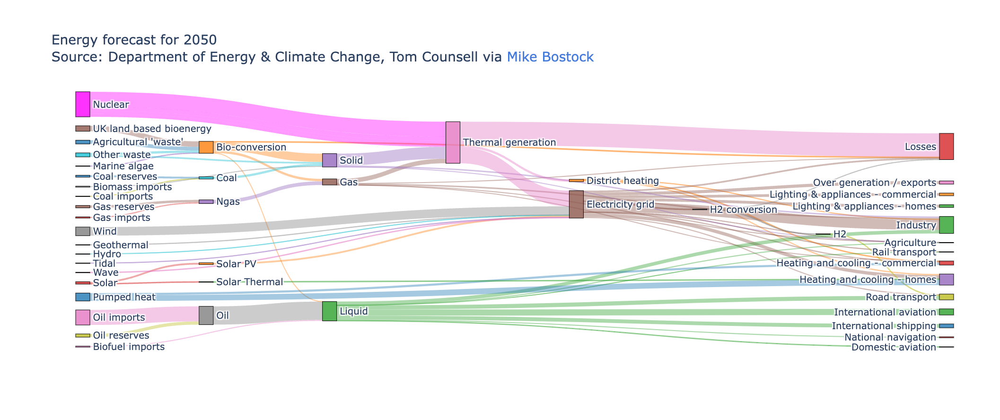

# GRU(2014) 복습

“밑바닥부터 시작하는 딥러닝 2”를 옮겼습니다. 그림은 직접 그렸습니다.

발전 과정 : RNN →LSTM(1997) →**GRU(2014)**

한줄요약 : GRU는 LSTM을 더 단순하게 만든 아키텍쳐이다. LSTM에서 3개의 게이트를 사용했다면, GRU는 update, reset 게이트라는 2개의 게이트만 사용하여 파라미터를 줄이고 시간은 적게 걸리면서 LSTM과 비슷한 성능을 낸다.\

<figure><figcaption>
GRU는 standard RNN과 입출력 모양은 같다.
</figcaption></figure>

LSTM에는 $$c$$라는 기억 셀이 존재했다. $$c$$는 밖으로 나가지 않고 셀 안에서만 계속 돌고 있는 애다. $$c_{t-1}$$이 $$c_t$$가 되기 위하여 지나는 게이트(문)의 개수는 3개였다. 바로 forget, input, output gate였다.

GRU는 2개의 게이트를 사용한다. 바로 $$r$$이라는 reset 게이트, $$z$$라는 update 게이트이다.

* reset gate : $$h_{t-1}$$를 얼마나 무시할 지를 결정함
* update gate : $$h$$를 갱신함

<figure><figcaption></figcaption></figure>

인풋이 조금 많고 복잡해 보이지만 다 $$h_{t-1}$$과 $$x$$이다. 어떻게 보면 기본 RNN에서 연산이 조금 더 많아진 것이다. 다른 말로 하면 파라미터의 수가 증가한 것이다.

GRU 셀 안에서 일어나는 연산은 크게 4가지로 나뉜다. 하나하나 뜯어보자.

## 1번 연산 : update 게이트 

<figure><figcaption>
update 게이트
</figcaption></figure>

어렵게 그림까지 그렸지만 그냥 어파인(Affine) 변환이다. $$z$$는 0에서 1 사이의 값을 갖는다. 위 그림에서 곱으로 표현된 연산은 아다마르 곱(원소별 곱)이다. update게이트는 여기까지만 알아도 될 것 같다.

$$
z=\sigma(x_tW_x^z + h_{t-1}W_h^z + b^z)
$$

## 2번 연산 : reset 게이트

<figure><figcaption>
reset 게이트
</figcaption></figure>

$$
r=\sigma(x_tW_x^r + h_{t-1}W_h^r + b^r)
$$

reset 게이트도 그냥 어파인 변환한 결과다. $$r$$도 0에서 1 사이의 값을 갖는다. 이게 무슨 의미를 갖는지?는 다음 연산에서 드러난다. 역시 위 그림에서 곱으로 표현된 연산은 원소별 곱이다.

## 3번 연산 : new hidden state 

어째 그림이 더 복잡한 것 같다…의도는 쉽게 이해하기 위함이었는데..

3번 연산은 2번 연산의 결과인 $$r$$을 받는다. 2번 계산에서 마지막 연산이 sigmoid였기 때문에 $$r$$은 0\~1값을 갖는다.

만약 $$r$$이 0이면 어떻게 될까? 참고로 $$r$$은 $$h_{t-1}$$과 곱해진다.

이 경우, 3번 연산을 통해 생성된 $$\tilde{h}$$는 오로지 $$x$$로만 만들어진다. **즉,** $$r$$**은** $$h_{t-1}$$**을 얼마나 무시할 지를 결정한다.**

* $$r=0$$ : 과거 정보 $$h_{t-1}$$를 모두 무시
* $$r=1$$ : 과거 정보 $$h_{t-1}$$를 모두 사용\

<figure><figcaption></figcaption></figure>

## 4번 연산

$$\tilde{h}$$는 최종 결과가 아니다. $$z$$로 업데이트를 해준다.

<figure><figcaption></figcaption></figure>

<figure><figcaption></figcaption></figure>

$$(1-z)\odot h_{t-1}$$ 부분은 forget 게이트의 기능을 한다. 과거 은닉 상태에서 잊어야 할 정보를 삭제한다. $$z \odot \tilde{h}$$부분은 input 게이트의 기능을 한다. 새로운 hidden state인 $$\tilde{h}$$에 input게이트의 가중치를 부여한다.

처음에 말했듯이 GRU는 LSTM을 “더 단순하게”만든 아키텍쳐이다. 따라서 LSTM보다 계산 비용을 줄이고 매개변수 수도 줄일 수 있다.

### LSTM과 GRU 중 어떤 것을 선택해야할까? 

하이퍼 파라미터에 따라 다르다. 다만 GRU는 매개변수가 적고 계산량도 적기 때문에 데이터셋이 적은 경우, 또는 반복적으로 많은 시도를 할 경우 적합하다. 최근 연구에서는 LSTM이 많이 사용된다.

